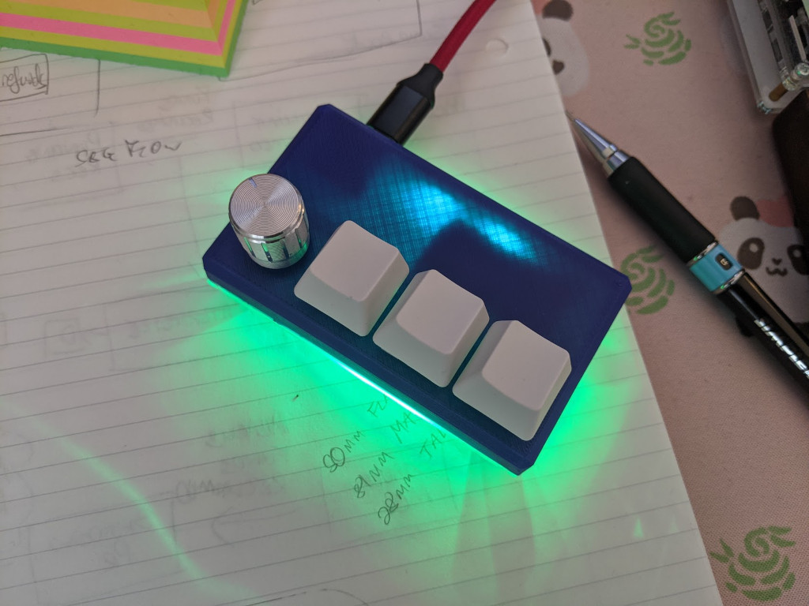

# twono

The basic firmware for the handwired twono macropad.

Make example for this keyboard (after setting up your build environment):

    make twono:default

Flashing example for this keyboard:

    make twono:default:flash

See the [build environment setup](https://docs.qmk.fm/#/getting_started_build_tools) and the [make instructions](https://docs.qmk.fm/#/getting_started_make_guide) for more information. Brand new to QMK? Start with our [Complete Newbs Guide](https://docs.qmk.fm/#/newbs).
